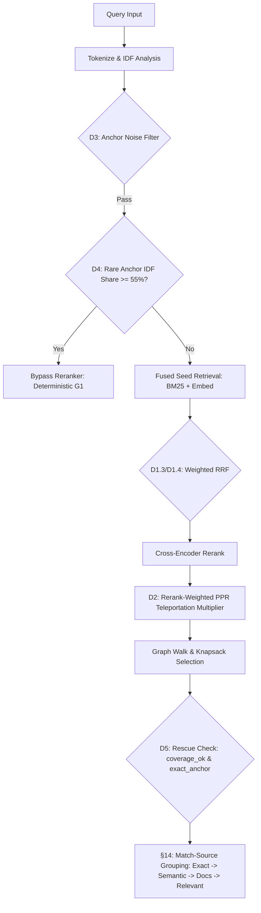

# RFC-022: Conceptual Retrieval, Over-Abstention Fixes & Match-Source Provenance Grouping

**Status:** Implemented & Measured — Core fixes (D2, D3, D4, D5) and §14 match-source provenance grouping **Default ON**; recall widening (D1, D1.3/D1.4, prototype) **Default OFF** behind feature flags pending Phase-4 calibration.  
**Author:** Senior Rust Engineer & Open-Source Maintainers  
**Date:** 2026-07-29  
**Crates affected:** `travsr-store` (`lib.rs`), `travsr-mcp` (`seed.rs`, `tools.rs`, `query.rs`), `travsr-cli` (`ask.rs`, `main.rs`), `travsr-daemon` (`lib.rs`), `travsr-vscode` (`parse.ts`, `contextExplorer.ts`, `contextCodeAction.ts`, `parse.test.ts`), `bench/` (`run-seeded-travsr.mjs`)  
**Depends on:** RFC-021 (Cross-Encoder Relevance Arbiter for Seed Selection)  
**Related:** Issue #376 (Phase 2 Docs Retrieval Lane)  

---

## 1. Summary

RFC-021 introduced the in-process cross-encoder reranker to arbitrate relevance and eliminate false positive `STRONG` confidence verdicts on off-topic queries. However, practical evaluation against natural-language conceptual queries (e.g., *"how are results trimmed to fit a token budget"*, *"shopping cart checkout payment flow"*, *"get map handle"*) revealed two systemic failure modes:

1. **Prose-to-Code Collapse & Over-Abstention:** Conceptual natural-language terms fail to match bare code signatures (which contain compound identifiers like `ppr_weighted` or `knapsack_budget`). The retrieval engine abstained (`Confidence::None`) on queries where relevant implementation code existed.
2. **False G1 Bypasses & Over-Rescue Leaks:** Incidental rare terms in natural-language queries (e.g. *"trimmed"*) or generic verbs (`get`, `map`, `handle`) triggered deterministic G1 symbol bypasses or anchor-rescue paths on irrelevant symbols or in-source test functions (`test_foo`).

RFC-022 addresses these root causes through a measured, RCA-driven set of core retrieval improvements (D1–D5), seed-pipeline diagnostic tracing (Phase 0), and a unified match-source provenance grouping scheme (§14).

---

## 2. Motivation & Problem Statement (evidence-based)

Evaluation of RFC-021 against conceptual queries on the `travsr` codebase identified five distinct root causes (RC-1 to RC-5):

### RC-1: Bare Signature Isolation
Code signatures (e.g., `fn:ppr_weighted`) hide the descriptive docstrings and natural-language concepts they implement. A conceptual query searching for *"personalized pagerank"* fails to hit SQLite FTS because the natural-language terms exist only in the docstring, which was stripped before indexing.

### RC-2: PPR Walk Disconnected from Reranker Judgment
While the cross-encoder scored seeds, Personalized PageRank (PPR) teleportation weights relied solely on raw BM25/IDF/cosine scores. High-scoring reranked seeds were out-voted in graph walks by clusters of low-rerank structural noise, dropping top-ranked nodes from the final knapsack selection.

### RC-3: Anchor-Pool Test Symbol & Package Noise
Inline test functions (`test_foo`, Go `TestFoo`, `BenchmarkFoo`, `FuzzFoo`) and CI/workflow package nodes (`pkg:actions/checkout`) contain descriptive names matching query terms. Emitting them as anchors caused them to out-rank real implementations and trigger false deterministic G1 bypasses.

### RC-4: Incidental Rare Term G1 Bypasses
In RFC-021, any rare exact anchor triggered the deterministic G1 bypass. Conceptual queries containing an incidental rare word (e.g., *"trimmed"* in *"how are results trimmed"*) forced G1 bypass onto wrong symbols (`trimmed()`), skipping natural-language cross-encoder evaluation.

### RC-5: Zero-Coverage Anchor Over-Rescue (WS4)
Generic query tokens (`get`, `map`, `handle`) emitted exact anchors (`idf_w >= 0.15`) but contributed zero to `idf_coverage_min` (`idf_w < 0.55`). Previously, the presence of an exact anchor alone rescued `coverage = 0.000` queries to `Confidence::Weak`, polluting abstention boundaries.

---

## 3. Detailed Specification & Technical Architecture

### 3.1 D1: Doc/Skeleton FTS Token Widening (RC-1)
* **Write-Path Widening:** During Phase A indexing, node docstrings (`doc:`) and structural AST text (`embed_text`) are folded into `nodes_fts`.
* **Doc-First Precedence:** Docstring prose is extracted first (`split_once("| doc:")`) to ensure natural-language terms lead before applying `MAX_EMBED_FTS_TOKENS = 48`.
* **Idempotent Reconciliation:** `backfill_fts_embed_text()` reconciles FTS content state dynamically when toggling `TRAVSR_FTS_EMBED_WIDEN` (version `"1"` vs `"0"`).
* **Flag:** `TRAVSR_FTS_EMBED_WIDEN` (Default **OFF**).

### 3.2 D1.3 / D1.4: Weighted Reciprocal Rank Fusion (Weighted RRF)
* **Per-Source Weights (`rrf_source_weights`):**
  - `TRAVSR_RRF_W_SPECIFIC_ANCHOR` = `2.0` (High-IDF specific anchors)
  - `TRAVSR_RRF_W_BM25` = `1.0` (Sparse BM25 leg)
  - `TRAVSR_RRF_W_EMBED` = `1.0` (Dense embedding leg)
  - `TRAVSR_RRF_W_GENERIC_ANCHOR` = `0.4` (Mid-IDF generic anchors)
* **Goal:** Prevents single-token generic anchors (`fn:set`) from crowding out multi-term BM25 or embedding candidates.
* **Flag:** `TRAVSR_RRF_WEIGHTED` (Default **OFF**).

### 3.3 D2: Rerank-Weighted PPR Personalisation (RC-2 Keystone)
* **Mechanism:** Teleportation weight for non-exact seed $i$ is scaled by a piecewise-linear multiplier $m(r_i)$ based on cross-encoder score $r_i$ and weak floor $w_f$:
  $$m(r_i) = \begin{cases} 
  0.1 + 0.9 \cdot \frac{r_i}{w_f} & \text{if } r_i \le w_f \\
  1.0 + 1.0 \cdot \frac{r_i - w_f}{1.0 - w_f} & \text{if } r_i > w_f 
  \end{cases}$$
* **Bounds:** Clamped to $[0.1, 2.0]$. Exact anchors retain unscaled structural weight.
* **Flag:** `TRAVSR_RERANK_PPR_WEIGHT` (Default **ON**, kill-switch `0`).

### 3.4 D3: Anchor-Pool Noise Filtering (RC-3)
* **Test Symbol Predicate (`is_test_symbol`):** Matches functions/methods starting or ending with `test_`, Go-style `TestFoo`, `BenchmarkFoo`, `FuzzFoo`.
* **Anchor Noise Predicate (`is_anchor_noise`):** Rejects bare file nodes, CI/workflow package nodes (`pkg:`), and test symbols from anchor emission and the KNN `cosine_oracle`.
* **Status:** Default **ON**.

### 3.5 D4: G1 Bypass Subject Dominance Gate (RC-4)
* **Subject IDF Share Requirement:** Deterministic G1 bypass requires rare exact anchors to carry $\ge 55\%$ of the query's total IDF mass:
  $$\frac{\sum_{t \in \text{RareExact}} \text{IDF}(t)}{\sum_{t \in \text{AllTerms}} \text{IDF}(t)} \ge 0.55$$
* **Flag:** `TRAVSR_G1_SUBJECT_IDF_SHARE` (Default `0.55`).

### 3.6 D5: Grounded Coverage Over-Rescue Gate (RC-5)
* **Grounded Coverage Requirement:** Rescuing an abstaining query (`Confidence::None`) to `Confidence::Weak` via an exact anchor requires `coverage_ok` (`n_resolved >= 1`), meaning at least one token cleared `idf_coverage_min` ($0.55$).
* **Status:** Default **ON**.

---

## 4. Section 14 (§14): Match-Source Provenance Grouping

To make retrieval certainty transparent to consuming LLMs and human engineers, §14 groups the selected knapsack node set into four ordered sections:

### 4.1 Section Structure & Trust Hierarchy
1. `## exact — literal symbol / FTS match (not reranked)` (Trust Rank 0)
2. `## semantic — cross-encoder ranked` (Trust Rank 1)
3. `## docs (documentation prose: claims about the code...)` (Trust Rank 2, #376)
4. `## relevant — graph-adjacent context` (Trust Rank 3)

### 4.2 Provenance Badge Hoisting (`omit_via`)
To optimize token usage:
* **Primary Seeds (Exact / Semantic):** The `[via: seed]` badge is **hoisted** into the section header and suppressed on individual rows (`omit_via = true`).
* **Graph Context (Relevant):** Individual rows retain their explicit badges (e.g. `[via: caller of X]`, `[via: dependency of X]`) because the section header cannot carry node-specific graph relationships.

### 4.3 Classification Uniformity (`strongest_seed_sources`)
Node classification uses a single precedence rank: $\text{Exact} > \text{Knn} > \text{Lexical}$. Nodes reached by multiple seeds are deterministically classified by their strongest source, ensuring `get_context` and `ask` CLI outputs remain identical.

---

## 5. Prototype: Doc-Aware Reranker Candidate Text

* **Mechanism:** Candidate text passed to the cross-encoder is augmented by prepending natural-language docstring prose from `embed_text` (`| doc: <prose>`).
* **Flag:** `TRAVSR_RERANK_DOC` (Default **OFF**).

---

## 6. Verification & Benchmark Baseline

Measured against the `bench/run-seeded-travsr.mjs` test suite on the travsr self-index:
* **Baseline Self-Index Accuracy:** Increased from **28/44 to 31/44** queries answered correctly.
* **Abstain Integrity:** **0 abstain leaks** across regression invariant sets (Literal 7/7, Rare 2/2, Salad 3/3, Nonsense 4/4).
* **Token Efficiency:** §14 section header hoisting resulted in strictly lower total byte/token count per query while preserving full provenance clarity.

---

## 7. Phased Rollout Summary

| Phase / Feature | Env Variable / Flag | Default State | Justification / Status |
| :--- | :--- | :--- | :--- |
| **Phase 0 Seed Tracing** | Tracing target | Enabled (`tracing::debug!`) | Diagnostics active |
| **D1 FTS Widening** | `TRAVSR_FTS_EMBED_WIDEN` | `0` (OFF) | Gated pending Phase-4 calibration |
| **D1.3/D1.4 Weighted RRF** | `TRAVSR_RRF_WEIGHTED` | `0` (OFF) | Gated pending Phase-4 calibration |
| **D2 Rerank PPR Weight** | `TRAVSR_RERANK_PPR_WEIGHT` | `1` (ON) | **Keystone feature — Default ON** |
| **D3 Anchor Noise Filter** | N/A | Hardcoded (ON) | Core safety fix |
| **D4 Subject IDF Share** | `TRAVSR_G1_SUBJECT_IDF_SHARE` | `0.55` | Core safety fix |
| **D5 Grounded Coverage** | N/A | Hardcoded (ON) | Core safety fix |
| **§14 Match-Source Grouping**| `TRAVSR_MATCH_SOURCE` | `1` (ON) | **Default ON** (Kill-switch `0`) |
| **Doc-Aware Reranker** | `TRAVSR_RERANK_DOC` | `0` (OFF) | Gated experimental prototype |
